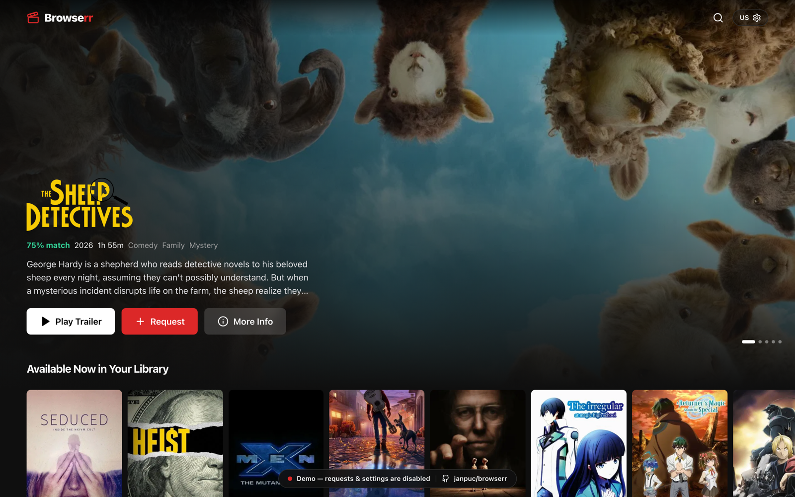
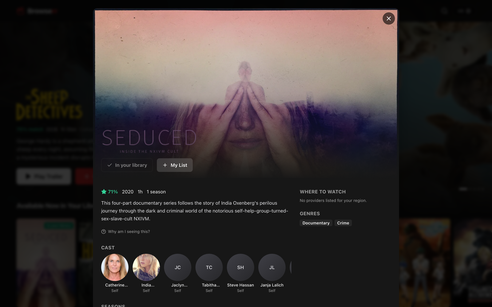
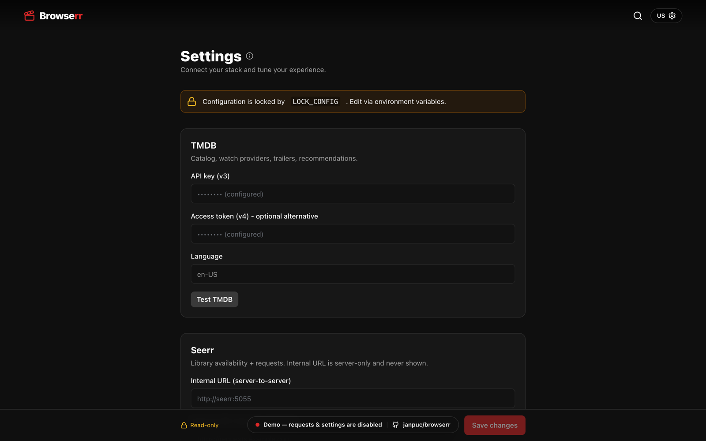

# Browserr

[](https://github.com/janpuc/browserr/actions/workflows/ci.yml)
[](https://github.com/janpuc/browserr/actions/workflows/docker-publish.yml)
[](https://github.com/janpuc/browserr/actions/workflows/pages.yml)
[](./LICENSE)
[](https://github.com/janpuc/browserr/pkgs/container/browserr)

**A self-hosted, Netflix-style discovery front-end for your media stack.**

> ### ▶️ [**Live demo →**](https://janpuc.github.io/browserr/)
> A keyless, read-only tour running on static fixtures - no TMDB key, no database, no requests.

Browserr turns _"what can I watch?"_ into a cinematic browse experience - rotating hero
billboards, genre and per-service rails, "Because you watched…" recommendations, and inline
hover trailers - across every streaming service available in your region. When you find
something you don't have yet, it hands off to **[Seerr](https://github.com/seerr-team/seerr)**
for "what's in my library" status and requests.

The name follows the `*arr`/Seerr convention: a **browser** for everything you can stream.

---

## Features

- **Netflix-style home** - full-bleed rotating hero, lazy horizontally-scrolling rails,
  hover-preview cards with muted trailer autoplay, and a rich detail modal.
- **Region & service aware** - only ever shows streaming services that TMDB lists for your
  selected region. Change region → the whole catalog and service list re-derive.
- **Seerr integration** - every title shows live library availability; request via redirect
  (open Seerr) or proxy (submit on your behalf). Uses a **separate internal URL** for
  server-to-server calls and **external URL** for browser redirects.
- **Self-learning recommendations** - a content-based taste profile that seeds from your
  library at cold-start and shifts as you interact. Includes "Because you watched X" rails and
  a "Why am I seeing this?" affordance.
- **Config via GUI _and_ env** - env seeds defaults; the in-app Settings screen overrides
  them (unless `LOCK_CONFIG=true`). No secrets or internal URLs ever reach the browser.
- **One Docker image** - drops into an existing `*arr`/Seerr stack via `docker-compose`.
- **Accessible & responsive** - keyboard/remote navigable, reduced-motion honored,
  dark-first theming with a configurable accent. Works desktop → tablet → mobile → 10-foot TV.

---

## Screenshots

> Try the **[live demo](https://janpuc.github.io/browserr/)**, or regenerate these locally with
> `npm run build:demo && npm run screenshots` (see [`docs/screenshots/`](docs/screenshots/)).

| Home | Title detail |
|---|---|
|  |  |



---

## Quick start

### With Docker Compose (recommended)

```bash
cp .env.example .env
# edit .env: add TMDB_API_KEY, SEERR_API_KEY, SEERR_EXTERNAL_URL, DEFAULT_REGION…
docker compose up -d
```

Open <http://localhost:3000>. The bundled `docker-compose.yml` also starts Seerr and wires
Browserr to it on the Docker network (`SEERR_INTERNAL_URL=http://seerr:5055`).

Prefer the **prebuilt multi-arch image** instead of building locally:

```yaml
# docker-compose.yml
services:
  browserr:
    image: ghcr.io/janpuc/browserr:latest   # or pin a release, e.g. :1.0.0  (:edge = latest main)
```

```bash
docker pull ghcr.io/janpuc/browserr:latest
```

### Local development

```bash
npm install
cp .env.example .env      # at minimum set TMDB_API_KEY
npm run dev               # http://localhost:3000
```

You only need a [TMDB API key](https://www.themoviedb.org/settings/api) to start browsing.
Seerr is optional - without it the catalog still browses and availability badges show
"Unknown".

> **Build/run note:** the production image runs the Next.js standalone server
> (`node server.js`). For a local production smoke test use `npm run build` then
> `node .next/standalone/server.js` (plain `next start` warns under `output: standalone`).

---

## Configuration

**Precedence (lowest → highest):** built-in defaults → **environment variables** → **GUI
settings (persisted in SQLite)**. The GUI overrides env. Setting `LOCK_CONFIG=true` freezes
config to env values and makes the GUI read-only - for locked-down deployments.

Everything is editable in the in-app **Settings** screen: connections (TMDB, Seerr), region,
services, feature toggles, and appearance. `DATABASE_URL`/`REDIS_URL` are env-only (they're
needed to reach the DB itself).

### Environment variables

| Variable | Default | Notes |
|---|---|---|
| `PORT` | `3000` | HTTP port |
| `PUBLIC_URL` | `http://localhost:3000` | External URL of Browserr itself |
| `TZ` | `UTC` | Timezone |
| `LOCK_CONFIG` | `false` | `true` ⇒ env is authoritative, GUI read-only |
| `TMDB_API_KEY` | - | TMDB v3 key (or…) |
| `TMDB_ACCESS_TOKEN` | - | …TMDB v4 bearer token |
| `TMDB_LANGUAGE` | `en-US` | Drives metadata language + title logos |
| `SEERR_INTERNAL_URL` | - | **Server-to-server** base (e.g. `http://seerr:5055`). Never sent to the client. |
| `SEERR_EXTERNAL_URL` | - | **Browser redirect** base (your public Seerr URL) |
| `SEERR_API_KEY` | - | `X-Api-Key` for Seerr |
| `SEERR_REQUEST_MODE` | `redirect` | `redirect` \| `proxy` |
| `DEFAULT_REGION` | `US` | ISO 3166-1 alpha-2 |
| `DEFAULT_SERVICES` | _(all)_ | CSV of TMDB provider IDs, e.g. `8,9,337` |
| `MONETIZATION_TYPES` | `flatrate` | CSV of `flatrate,free,ads,rent,buy` |
| `AUTH_MODE` | `none` | `none` \| `seerr` \| `basic` |
| `BASIC_AUTH_USER` / `BASIC_AUTH_PASS` | - | Used when `AUTH_MODE=basic` |
| `DATABASE_URL` | `sqlite://./data/browserr.db` | `sqlite://…` path (env-only) |
| `REDIS_URL` | - | Optional (LRU cache is the default) |
| `ENABLE_RECOMMENDATIONS` | `true` | Self-learning rails |
| `ENABLE_EMBEDDINGS` | `false` | Reserved for optional semantic recs |
| `RECS_REFRESH_CRON` | `0 */6 * * *` | Refresh cadence (hour-interval honored) |
| `ENABLE_LIBRARY_RAILS` | `true` | "Available now in your library" rails |
| `ENABLE_TRAILER_AUTOPLAY` | `true` | Muted hover trailers |
| `HERO_ROTATE_SECONDS` | `12` | Hero billboard rotation |

### ⚠️ The internal/external Seerr split (mandatory)

`SEERR_INTERNAL_URL` is used by Browserr's **server** for all `/api/v1` calls (availability
lookups, proxied requests) - typically a Docker-network address. `SEERR_EXTERNAL_URL` is used
**only** to build links the user's **browser** opens. The internal URL is never exposed to the
client: `/api/config` omits it entirely, and the Settings form treats it as a write-only field.

---

## How region & service selection works

1. The region picker is populated from TMDB `GET /watch/providers/regions`.
2. For the selected region, Browserr fetches movie + TV watch providers and shows the
   **union (deduped by `provider_id`, ordered by `display_priority`)** - and nothing else.
3. You multi-select the services you subscribe to (or "All"). These are stored as TMDB
   provider IDs and are always **intersected with what's actually available in the region**, so
   a stale ID can never leak into queries.
4. Per-service and genre rails use TMDB `discover` with `watch_region`, `with_watch_providers`,
   and `with_watch_monetization_types`.

Changing the region re-derives the service list and the whole catalog.

## Recommendations

The available library is itself the primary taste signal, refined by interactions:

- **Signals** (weighted, time-decayed): request / watchlist / watched / trailer-played
  (positive), detail-open / long-hover (weak positive), not-interested / hide (negative).
- **Profile**: a sparse feature vector built from each title's TMDB metadata (genres, keywords,
  top cast, director/creator, language, decade, runtime). The per-user profile is a
  time-decayed aggregate of positive-signal vectors minus negatives.
- **Scoring**: cosine similarity to the profile, blended with a popularity/quality prior and an
  **availability boost** (titles on your services / in your library), with greedy diversity so
  rails aren't monotonous.
- **"Because you watched X"**: TMDB recommendations + similar for a recent strong-signal title,
  re-ranked by local feature similarity.
- **Cold start**: seeded from your Seerr library composition (or popular-in-region if Seerr
  isn't connected).
- **Transparency**: every title has a "Why am I seeing this?" explainer; Settings has a
  "Reset taste profile" control.

---

## Architecture

```
src/
  app/                    Next.js App Router
    api/                  BFF route handlers (proxy/normalize TMDB + Seerr, hide secrets)
    layout.tsx page.tsx   server shell (+ starts the cron worker)
    settings/             Settings screen
  components/             Hero, Rail, MediaCard, DetailModal, Navbar, Settings… (+ providers)
  lib/                    client-safe types, config schema, api client, image/availability utils
  server/
    config.ts env.ts      config precedence (defaults → env → DB) + LOCK_CONFIG
    db/                   libsql + Drizzle schema (idempotent migrate on boot)
    tmdb/ seerr/          upstream clients (cached, retrying, resilient)
    recommend/            features, taste profile, scoring engine, signal capture
    rails/                home-feed composition
    region.ts cron.ts     region/service engine + background refresher
```

**Stack:** Next.js (App Router) · React · TypeScript · Tailwind · Framer Motion · TanStack
Query · Drizzle ORM on libsql (SQLite). Native-scroll rails for trackpad/touch. TMDB + Seerr
secrets stay server-side; the browser only talks to the BFF.

### BFF API

| Method | Route | Purpose |
|---|---|---|
| `GET` | `/api/health` | Liveness + configured flags |
| `GET`/`PUT` | `/api/config` | Public config / save settings |
| `GET` | `/api/regions` | TMDB regions |
| `GET` | `/api/services?region=` | Services available in a region |
| `GET` | `/api/home` | Composed hero + rails |
| `GET` | `/api/title/:type/:id` | Detail + availability + redirect URL |
| `POST` | `/api/availability` | Batch Seerr availability (badge hydration) |
| `POST` | `/api/request` | Redirect or proxy a request |
| `POST` | `/api/signals` | Capture an interaction |
| `GET` | `/api/recommendations/explain` | "Why am I seeing this?" |
| `POST` | `/api/recommendations/reset` | Forget taste profile |
| `GET` | `/api/search?q=` | Multi-search |
| `POST` | `/api/connection-test` | Test TMDB/Seerr credentials |

---

## Security & resilience

- All TMDB/Seerr secrets and the Seerr **internal URL** stay server-side.
- Mutations are same-origin guarded (CSRF) and rate-limited; the external redirect URL is
  sanitized.
- If Seerr is unreachable the catalog still browses and badges show "Unknown"; TMDB calls
  retry with backoff and serve stale-on-error from cache.

## Out of scope (v1)

Direct playback (Browserr discovers and hands off), writing watch history back to media
servers, native mobile apps (PWA-ready), and household blended profiles.

## Demo build

The **[live demo](https://janpuc.github.io/browserr/)** is a static export served from GitHub
Pages - no TMDB key, no Seerr, no database. It runs on bundled JSON snapshots under
`public/demo/` (public TMDB catalog data + image URLs only); requests and settings are
disabled. Build it yourself with `npm run build:demo` (output in `out/`), and refresh the
fixtures from a running dev server with `npm run demo:fixtures`.

## Contributing

PRs welcome! See **[CONTRIBUTING.md](./CONTRIBUTING.md)** for local setup, the branch model
(GitHub Flow), and the SemVer release/tagging flow. The gate is `npm run typecheck` +
`npm run build`. Please report security issues privately via a
[security advisory](https://github.com/janpuc/browserr/security/advisories/new).

## License

[MIT](./LICENSE) © Jan Puciłowski.
